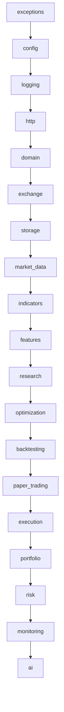

# Quant Platform Architecture Documentation

## Repository Philosophy
The Quant Platform is designed as a professional-grade, long-term quantitative cryptocurrency trading system. It prioritizes:
- **Absolute Type Safety**: Enforced strict-mode static type checks.
- **Incremental Stability**: Each milestone delivers a clean, operational build with 100% test coverage.
- **Clean Separation of Concerns**: Clean boundaries between business domain definitions and infrastructure/API implementations.

---

## Architecture Principles
1. **Unidirectional Dependencies**: Packages must import only from packages above themselves in the import chain.
2. **Business Capabilities Over Layers**: Directories correspond to high-level system functions (e.g. `backtesting`, `risk`, `execution`) rather than technical abstractions (`models`, `views`, `controllers`).
3. **Purity of Domain Model**: The `domain/` package represents pure business logic and must remain free from all network, storage, database, configuration, and logging dependencies.
4. **No Shared/Common Packages**: Generic "utils" or "common" directories are strictly prohibited to avoid coupling.

---

## Folder Structure
```text
bybit_quant_agent/ (Repository Root)
├── config/              # YAML config files and templates
├── data/                # Data storage (market, backtests, paper, live)
├── docs/                # Architecture, API, and Engineering milestone docs
├── logs/                # Application runtime logs
├── scripts/             # Automation and convenience scripts
├── tests/               # Test suites mirroring the src/ structure
└── src/
    └── quant_platform/  # Python package root
        ├── __init__.py
        ├── main.py      # Entry point and Composition Root
        ├── exceptions/  # Central error & exception framework
        ├── http/        # Reusable HTTP transport layer
        └── [packages]   # 17 standard business modules
```

---

## Package Responsibilities
Each package under `src/quant_platform/` has a single, strictly defined scope of responsibility:

| Package | Responsibility |
|---|---|
| `exceptions` | Central error and exception definitions (pure, no logging/IO dependencies). |
| `config` | Configuration loading, schema definitions, validation. |
| `logging` | Centralized Stream and Rotating File logging. |
| `http` | Reusable, exchange-agnostic HTTP transport client (Session, pool, retry). |
| `domain` | Business types, enums, constants, validation (pure domain). |
| `exchange` | REST and WebSocket communication with Bybit, authentication. |
| `storage` | Persistent storage integration, Parquet format, repository layers. |
| `market_data` | Historical market data downloaders, local caching, validation. |
| `indicators` | Technical indicator formulas and calculations (pure). |
| `features` | Feature engineering transformations and processing pipelines. |
| `research` | Strategy research notebook resources, experimentation metrics. |
| `optimization` | Parameter search, walk-forward analysis, hyperparameter tuning. |
| `backtesting` | Event-driven or vector-based historical simulation engine. |
| `paper_trading` | Real-time mock execution and portfolio simulation. |
| `execution` | Live order routing, position tracking, exchange synchronizers. |
| `portfolio` | Risk-parity, capital allocation, rebalancing calculators. |
| `risk` | Capital constraints, drawdown tracking, automated kill switches. |
| `monitoring` | Application health checks, system metrics, push alerts. |
| `ai` | Strategy review and assistance modules. |

---

## Dependency Graph & Import Rules
Import hierarchy goes sequentially downward. Packages may only import from packages positioned **above** them in the flow:



### Import Constraints
1. **Never Import Below**: A package must never import from any package lower than itself in the chain (e.g. `domain` cannot import from `exchange`).
2. **Never Import Sideways**: Sideways imports are disabled unless explicitly documented and verified in architectural reviews.
3. **No Circular Imports**: Dependencies must be strictly acyclic.
4. **Wildcard Imports**: Wildcard (`from x import *`) imports are prohibited.

---

## Naming Conventions
- **Packages/Modules**: Lowercase snake_case (e.g., `market_data`).
- **Classes/Type Parameters**: PascalCase (e.g., `Symbol`).
- **Functions/Methods/Variables**: Lowercase snake_case (e.g., `load_config`).
- **Constants**: Uppercase snake_case (e.g., `MAX_SYMBOL_LENGTH`).
- **Test files**: Prefixed with `test_` (e.g., `test_logging.py`).

---

## HTTP Transport Layer
The HTTP transport layer is a reusable, exchange-agnostic client package defined in `src/quant_platform/http/`.

### Responsibilities
- **Connection Reuse**: Enforces the use of `requests.Session` for persistent connections and automatic connection pooling.
- **Retry Logic**: Configures native retry strategies using `urllib3.util.Retry` mounted to HTTP connections, avoiding manual sleep loops.
- **Exception Isolation**: Catches all library-specific exceptions (e.g. `requests.exceptions.Timeout`, `requests.exceptions.ConnectionError`) and re-raises them as internal project-specific exceptions (`TimeoutError`, `ConnectionError`, `QuantPlatformError`).
- **Domain Blindness**: Remains completely unaware of cryptocurrency, exchange API keys, order placement, or exchange endpoint formats.

### Public API
The package exposes only the following public interfaces:
- `HttpClient`: Constructor takes `HttpConfig` and a `logging.Logger` through dependency injection.
  - `get(url, params=None, headers=None)`: Performs a GET request with automatic timeout and retries, returning a typed `HttpResponse`.
  - `post(url, data=None, json=None, headers=None)`: Performs a POST request with automatic timeout and retries, returning a typed `HttpResponse`.
  - `close()`: Closes the underlying HTTP session connection pool.
- `HttpConfig`: Configuration Pydantic model for pooling, timeouts, and retries.
- `HttpResponse`: Dataclass response object carrying status, headers, text, and a `.json()` method.

### Future Usage
This package will be injected into the `exchange` and `market_data` packages to perform authenticated REST requests with Bybit.

---

## Exception Framework
The platform uses a centralized exception framework defined in `src/quant_platform/exceptions/`.

### Hierarchy
- **QuantPlatformError**: The base class for all custom exceptions.
  - **ConfigurationError**: Raised on configuration loading or validation failures.
  - **LoggingError**: Raised on logging initialization or rotating file handler setup failures.
  - **ValidationError**: Raised on domain-level constraints violations.
  - **StorageError**: Raised on file read/write or parquet parsing failures.
  - **MarketDataError**: Raised on market data retrieval or processing failures.
  - **ResearchError**: Raised during notebook analysis or metrics extraction.
  - **BacktestError**: Raised during historical backtest simulation.
  - **ExecutionError**: Raised on order submission, cancellation, or synchronization failures.
  - **RiskError**: Raised when risk controls or drawdown limits are violated.
  - **ExchangeError**: Base class for exchange integration issues.
    - **AuthenticationError**: Raised on API key/signature failures.
    - **ConnectionError**: Raised on network connection drops or WebSocket disconnects.
    - **TimeoutError**: Raised when API requests exceed timeframe limits.
    - **RateLimitError**: Raised when Bybit rate limit responses (HTTP 429) are received.
    - **InvalidResponseError**: Raised when response payloads cannot be parsed.

### Extension Guidelines
When defining new exceptions:
1. **Never inherit from built-ins directly**: All new domain exceptions must inherit from `QuantPlatformError` (or one of its subclasses).
2. **Pure Implementation**: Custom exceptions must not trigger any side-effects. Never perform logging or any I/O operations (file, database, network) inside exception constructors or string formatting methods.
3. **Chaining Preservation**: Ensure that exceptions wrap root causes using Python's `raise ... from` syntax.

---

## Future Extensions & Extension Rules

When implementing future milestones:
1. **Build inside the structure**: Place all new capabilities within the corresponding 17 pre-defined packages.
2. **No new top-level packages**: The layout of `src/quant_platform/` established here is static and final.
3. **Initialize correctly**: Ensure every sub-package folder contains `__init__.py` (both in `src/` and `tests/`).
4. **Maintain Test Mirroring**: Place all tests inside their mirrored packages (e.g. `tests/execution/test_orders.py` mirrors `src/quant_platform/execution/orders.py`).
